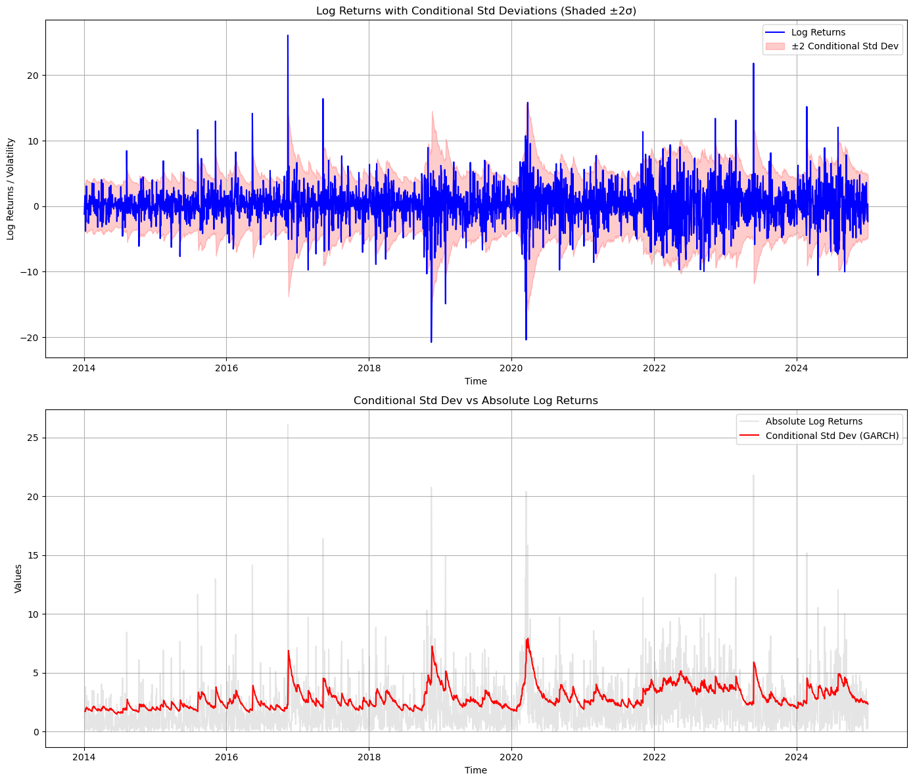
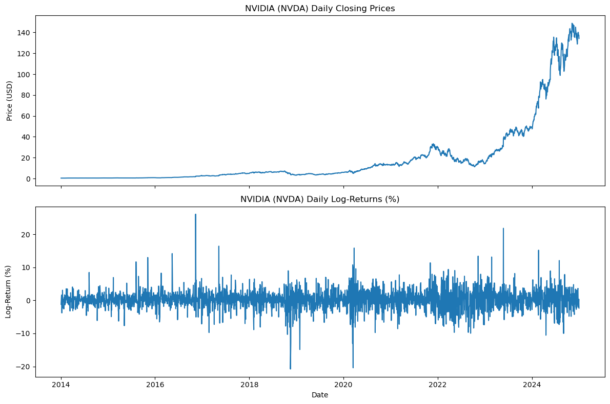
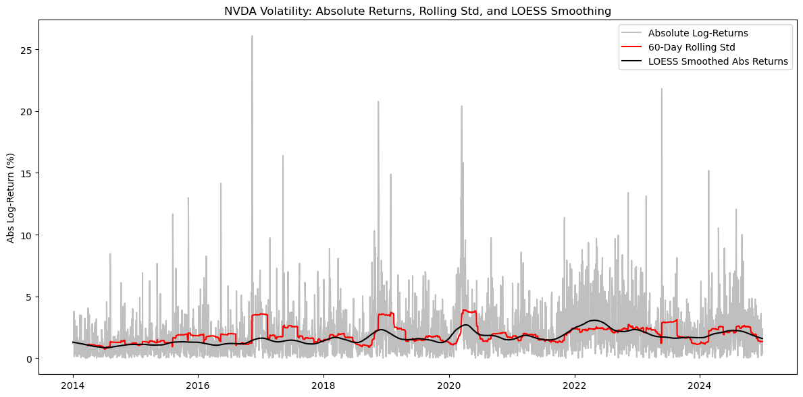
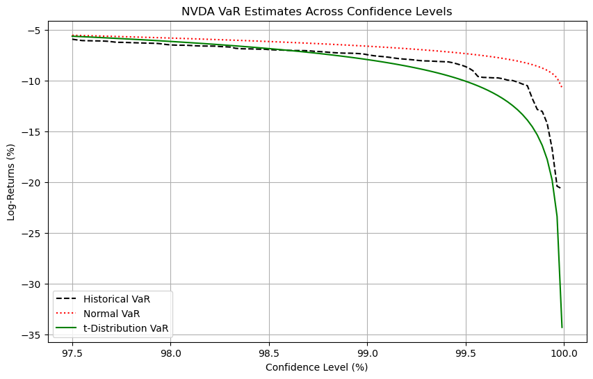
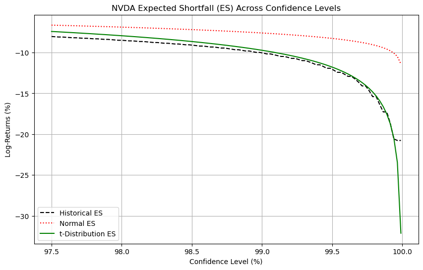
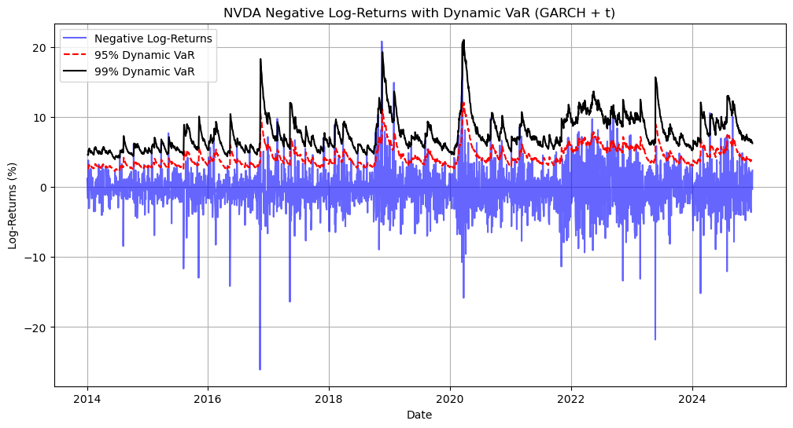
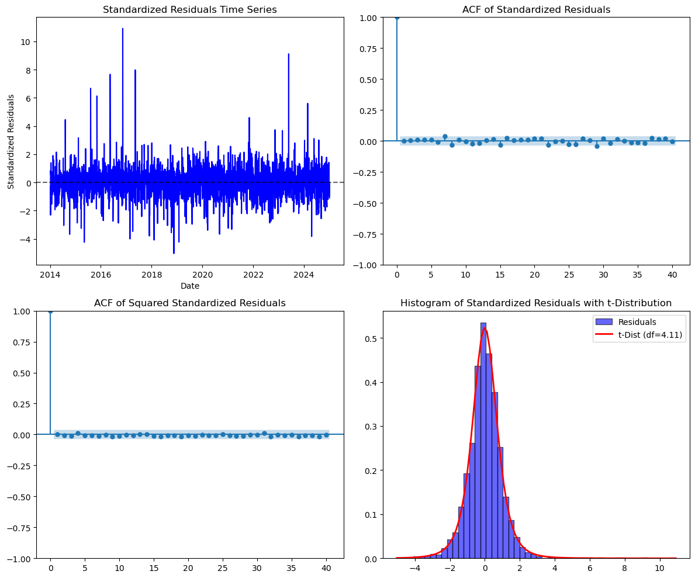
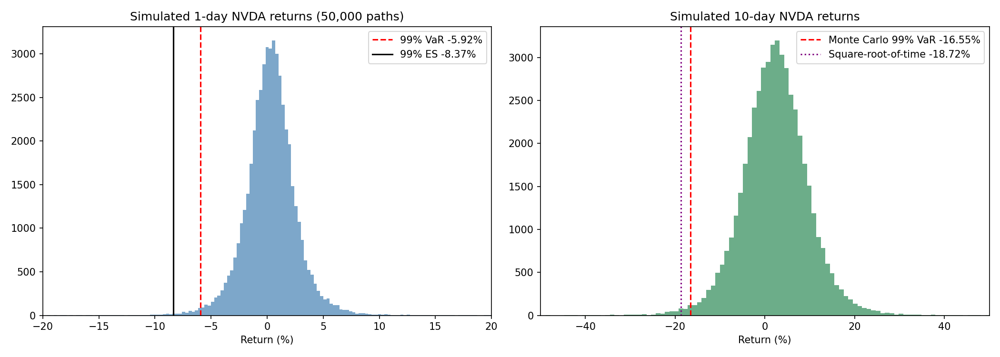

# NVIDIA Volatility Modeling & Risk Analysis

Modelling how volatile NVIDIA stock really is, and turning that into concrete downside-risk
numbers: Value-at-Risk, Expected Shortfall, a time-varying risk band, and a next-day forecast.

<p align="center">
  
</p>

---

## Overview

NVIDIA (NVDA) is one of the most volatile large-cap stocks of the last decade. That makes it a
good test case for a basic question in risk management: **how much can you lose on a bad day,
and does the usual "returns are normally distributed" assumption get that number right?**

This project analyses eleven years of daily NVDA returns (2014–2024), fits ARCH and GARCH
volatility models, and uses them to estimate downside risk three different ways. Result: NVDA returns have fat
tails and volatility clusters, so a normal-distribution risk estimate understates the worst
days (99% Expected Shortfall of −7.6% vs −11.8% under a t-distribution).

> **Context.** Group project (Group 8) for *Big Data & Artificial Intelligence for Operations
> Management*, IE Master in Business Analytics & Data Science. NVIDIA is the subject of the
> analysis, using public market data — not a client.

---

## Business Problem

Anyone holding NVDA — an investor, a portfolio manager, or a treasury team — needs to size
capital buffers and risk limits. That requires answering:

1. Is NVDA's volatility constant, or does it change over time?
2. Are extreme moves more common than a normal distribution predicts?
3. How large is the loss on a bad day, and how much worse is the average loss on the *worst* days?

## Objectives

- Characterise the return distribution and test it for normality and stationarity
- Model time-varying volatility, comparing ARCH(1) against GARCH(1,1)
- Validate the chosen model with residual diagnostics
- Estimate VaR and Expected Shortfall under historical, normal and Student-t assumptions
- Produce dynamic (time-varying) VaR and a one-step-ahead volatility forecast

---

## Dataset

| | |
|---|---|
| **Source** | Yahoo Finance, downloaded at runtime via `yfinance` |
| **Ticker** | NVDA |
| **Period** | January 2014 – December 2024 |
| **Observations** | 2,767 daily log returns |
| **Variable** | Daily log return in %, `100 × ln(Close_t / Close_{t−1})` |

No data file is stored in the repo — the notebook downloads it directly.

---

## Approach

1. **Data collection** — daily prices from Yahoo Finance; log returns computed in percent
2. **Exploration** — price and return series, summary statistics, normality test, rolling volatility with LOESS smoothing
3. **Dependence and stationarity** — ACF/PACF of returns and squared returns; Augmented Dickey-Fuller tests on price and returns
4. **Volatility modelling** — AR(1)-ARCH(1) baseline vs AR(1)-GARCH(1,1) with Student-t errors, compared on AIC/BIC
5. **Diagnostics** — standardised residuals, Ljung-Box tests, Q-Q and distribution checks
6. **Risk estimation** — VaR and Expected Shortfall across confidence levels (historical, normal, t)
7. **Dynamic risk** — GARCH-based 95% and 99% VaR that moves with market conditions
8. **Forecasting** — one-step-ahead mean and volatility forecast

---

## Key Findings

**1. Returns are strongly fat-tailed.**

| Statistic | Value |
|---|:---:|
| Mean daily log return | 0.21% |
| Variance | 8.61 |
| Skewness | 0.23 |
| Kurtosis | **10.29** (normal distribution = 3) |
| Normality test (D'Agostino-Pearson) | p < 0.0001 — **rejected** |
| Student-t fit, degrees of freedom | **3.35** |
| Worst / best single day | −20.8% / +26.1% |

Skew is close to zero, so the distribution is roughly symmetric — but a kurtosis over three
times the normal benchmark, and a t-distribution needing only ~3 degrees of freedom, mean
extreme days happen far more often than a normal model allows.

**2. Volatility clusters and persists.** Squared returns show significant autocorrelation, and
the fitted GARCH(1,1) confirms it:

| Parameter | Estimate | p-value | Meaning |
|---|:---:|:---:|---|
| α₁ (shock) | 0.064 | 0.0006 | Large moves raise volatility the next day |
| β₁ (persistence) | 0.929 | < 0.001 | High volatility stays high |
| α₁ + β₁ | **0.993** | | Volatility shocks decay very slowly |
| ν (t-distribution df) | 4.12 | < 0.001 | Fat tails remain even after modelling volatility |

**3. GARCH(1,1) clearly beats ARCH(1).**

| Model | AIC | BIC |
|---|:---:|:---:|
| AR(1)-ARCH(1), normal errors | 13,675.03 | 13,698.73 |
| **AR(1)-GARCH(1,1), t errors** | **13,016.48** | **13,052.03** |

**4. The model is well specified.** Ljung-Box tests at lag 10 find no remaining
autocorrelation in the standardised residuals (p = 0.60) or in the squared standardised
residuals (p = 0.98) — the model has absorbed both the return dynamics and the volatility
clustering.

**5. The normal assumption understates tail risk — and the gap widens as you go further out.**

Daily VaR and Expected Shortfall, in % log return:

| | Historical | Normal | Student-t |
|---|:---:|:---:|:---:|
| **VaR 97.5%** | −5.93 | −5.54 | −5.63 |
| **VaR 99%** | −7.45 | −6.62 | **−7.93** |
| **ES 97.5%** | −8.04 | −6.65 | −8.66 |
| **ES 99%** | −10.08 | −7.61 | **−11.81** |

At 99%, the normal model's Expected Shortfall is −7.6%; the fat-tailed t model puts it at
−11.8% — **more than 50% larger**. Historical data sits between the two, and well below the
normal estimate. The ordering of VaR estimates also shifts with confidence level: at 97.5% the
historical VaR is the most severe, while by 99% the t-distribution is — the tail is where the
models genuinely disagree.

*The notebook plots these curves across confidence levels; the point values above were
computed with the notebook's exact method and data.*

**6. Risk is not constant over time.** The GARCH-based 99% dynamic VaR has a median of 6.9%,
but peaked at 21.0% in March 2020 and 19.2% in late 2018 — about three times its typical level
and four times its calmest. A single static VaR figure would be too loose in a crisis and too
tight in quiet markets.

**7. Next-day forecast** (from the end of the sample): expected return 0.29%, volatility
σ = 2.38%.

---

## Business Recommendations

1. **Do not size NVDA risk with a normal-distribution VaR.** It understates the 99% Expected
   Shortfall by roughly a third relative to the t model. Use a fat-tailed or historical method.
2. **Report Expected Shortfall alongside VaR.** VaR says where the bad days start; ES says how
   bad they get. For NVDA the gap is large — at 99%, ES is about 1.5× VaR under the t model.
3. **Use time-varying limits rather than a fixed buffer.** Because volatility is highly
   persistent (α₁ + β₁ ≈ 0.99), elevated risk lingers for weeks after a shock. Risk limits and
   hedge ratios should be tightened when GARCH volatility rises, not reviewed on a fixed calendar.
4. **Treat NVDA as a high-volatility asset in capital planning.** Single-day moves beyond ±20%
   occurred in the sample; buffers should reflect that.

---

## Technologies

| Purpose | Tools |
|---|---|
| Data | Python, pandas, NumPy, `yfinance` |
| Statistics & time series | SciPy, statsmodels (ADF, ACF/PACF, Ljung-Box, LOESS) |
| Volatility models | `arch` (ARCH / GARCH with Student-t errors) |
| Visualisation | Matplotlib, Seaborn |
| Environment | Jupyter |

---

## Project Structure

```
├── nvidia_volatility_risk.ipynb   # Full analysis, executed with outputs
├── monte_carlo_var_extension.ipynb  # Individual extension: Monte Carlo 1-day and 10-day VaR
├── figures/                       # All charts exported from the notebook
├── docs/
│   └── presentation.pdf           # Group presentation slides
├── requirements.txt
└── README.md
```

---

## How to Run

```bash
python -m venv .venv
source .venv/bin/activate
pip install -r requirements.txt
jupyter notebook nvidia_volatility_risk.ipynb
```

Run all cells in order. An internet connection is needed for the Yahoo Finance download.
The notebook runs end to end without errors; re-running it reproduces the committed results to
at least four decimal places (Yahoo Finance occasionally revises adjusted prices, which can
shift the smallest decimals).

---

## Results

| | |
|---|---|
|  |  |
| NVDA price and daily log returns | Absolute returns with rolling and smoothed volatility |
|  |  |
| VaR across confidence levels, three methods | Expected Shortfall across confidence levels |
|  |  |
| GARCH-based 95% and 99% dynamic VaR | Residual diagnostics for the GARCH(1,1)-t model |

---

## Extension: Monte Carlo VaR (individual work)

*Added by Aylin Yaşgul after the group project, in `monte_carlo_var_extension.ipynb`.*

Uses the same AR(1)-GARCH(1,1)-t model to simulate 50,000 possible 10-day paths from the last day of 2024,
giving a fourth VaR method alongside historical, normal and Student-t.

| Horizon | 99% VaR | 99% Expected Shortfall |
|---|:---:|:---:|
| 1-day | −5.92% | −8.37% |
| 10-day | −16.55% | −22.00% |

- **Conditional risk:** volatility at the end of 2024 (2.35% a day) was below the model's long-run level (3.77%),
  so the forward-looking 1-day VaR is smaller than the full-sample estimates above.
- **Multi-day horizon:** scaling the 1-day VaR by √10 gives −18.72%, overstating the simulated 10-day VaR by about 13%,
  because fat-tailed daily shocks partly average out over several days.



---

## Limitations

- **In-sample only.** The model is fitted and evaluated on the same 2014–2024 data. The dynamic
  VaR is not backtested, so its real-world coverage is unverified.
- **Unconditional static VaR.** The static VaR/ES figures use the full-sample distribution and
  ignore the time-varying volatility the GARCH model identifies.
- **Symmetric volatility response.** GARCH(1,1) treats good and bad shocks alike; equity
  volatility typically rises more after losses than after gains.
- **Single asset.** No portfolio, correlation or diversification effects are considered.
- **One-step forecast only (main notebook).** The Monte Carlo extension adds a 10-day horizon, which is what most capital calculations use.
- **Regime effects.** NVDA's 2014–2024 run includes an exceptional AI-driven
  re-rating; the period may not represent its future risk profile.

---

## Future Improvements

- Backtest the dynamic VaR with Kupiec and Christoffersen tests to check exception rates
- Fit asymmetric models (GJR-GARCH, EGARCH) to capture the leverage effect
- Use filtered historical simulation for conditional VaR and ES
- Extend to a multi-asset portfolio (multi-day horizons are covered in the Monte Carlo extension)

---

## Team

Group 8, Section 1: Sebastião Clemente, Jia Yi Rachel Lee, Aylin Yaşgul, Omar Ajlouni,
Marcos Ortiz, Jan Wilhelm Pietsch.
